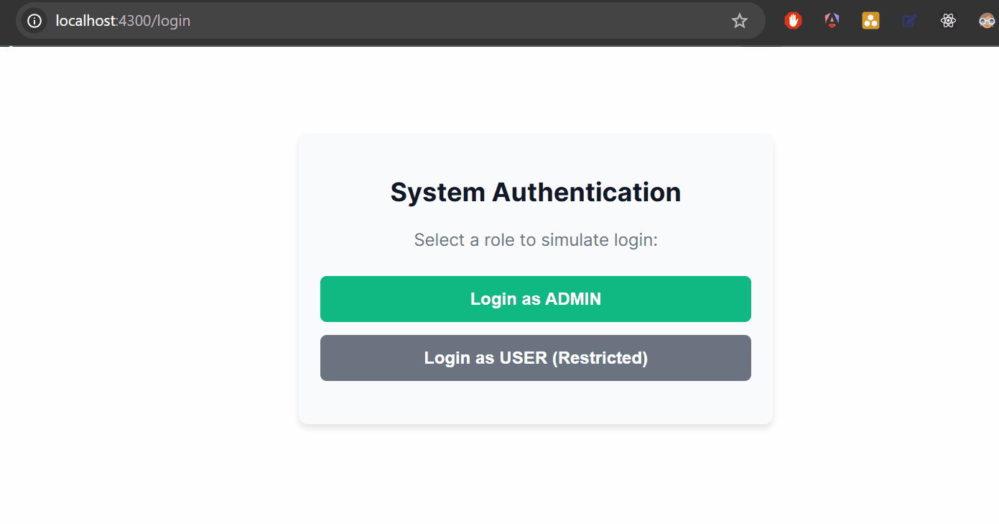

# Fix the Bug: Admin Dashboard Guard

## O Problema
O nosso portal administrativo está com sérias falhas de segurança e usabilidade nas rotas protegidas. O desenvolvedor reportou que o `AuthGuard` não está funcionando como deveria:

1. **Acesso Negado aos Admins:** Usuários com a role 'ADMIN' estão sendo barrados e mandados para fora, enquanto usuários comuns (ou visitantes) conseguem visualizar o painel.
2. **Navegação Quebrada:** Quando um usuário tenta acessar o dashboard sem estar logado, a aplicação não o redireciona para a tela de login; a URL simplesmente não muda e nada acontece.
3. **Erro de Console:** Se tentarmos acessar a rota sem ter feito login previamente, a aplicação quebra lançando um erro de "null pointer" no console.

## Comportamento Esperado
- A rota `/dashboard` deve ser acessível **apenas** se o `authService.getUser()` retornar um usuário com `role === 'ADMIN'`.
- Caso o usuário não seja Admin ou não esteja logado, o Guard deve redirecioná-lo obrigatoriamente para `/login` usando `router.navigate()`.
- O Guard deve lidar com o caso do usuário ser `null` sem quebrar a aplicação.

## Requisitos de Teste (data-test-id)
- Mensagem de Boas-vindas (Dashboard): `welcome-msg`
- Botão de Login: `login-btn`
- Input de Status do Usuário (Simulado): `user-role-display`
